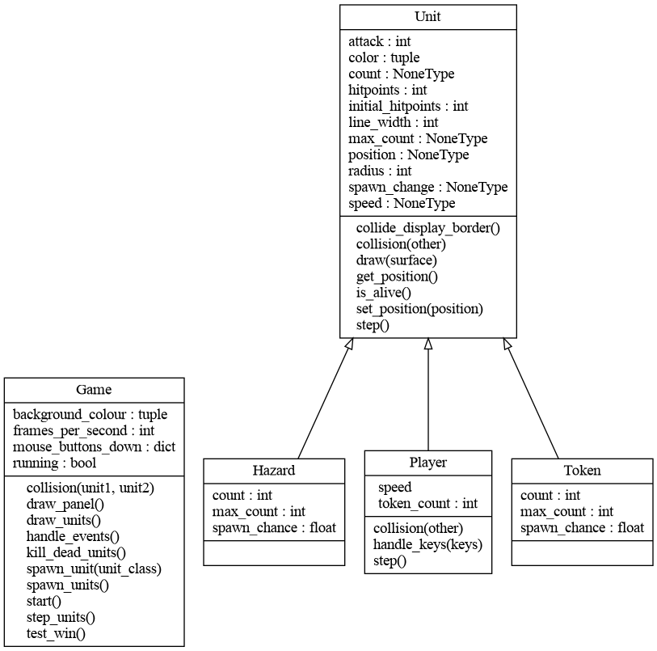
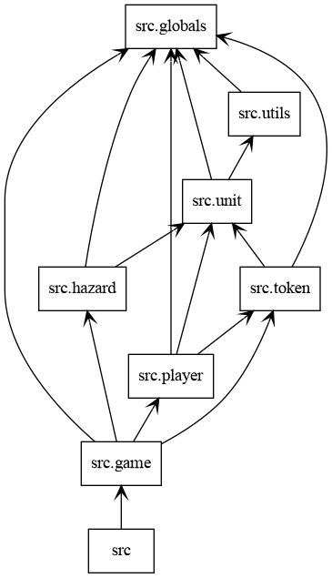

## Fork

- create or login to your GitHub acount
- create your own fork by clicking 'Fork' on one of [these repos](README.md#active-forks)
- clone your fork

## Make Changes

Read the code and make your changes:
- change behavior
- add a unit
- add special effects
- add new game dynamics
- ... 

For an overview of code structure see these classes:

and import relations:

## Submit Changes

- go to your fork on GitHub
- get all changes by others by clicking 'X commits behind'
- 'git pull' these changes to your local working copy 
- merge these changes with your changes
- 'git push' the merged changes back to your fork
- send a 'Pull Request' to the repo you forked from by clicking 'Contribute' > 'Open pull request'

If merging was too difficult, or your pull request is not accepted (maybe because your changes made the code too complex for beginners), send me the URL of your fork so I can add it as [active forks](README.md#active-forks) so people can play and make further changes on your fork.