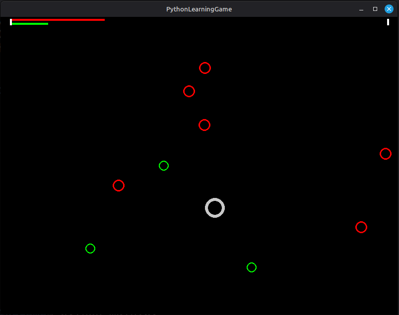

# PythonLearningGame
Game development by the [PythonLearning](https://www.reddit.com/r/PythonLearning/) Reddit community.

I need your help to make this a fun Python game. It's purely educational, an opportunity to learn about:
- Python
- (quick and dirty) Object Oriented Programming
- PyGame
- team work using GIT 

This should be accesible for Python students how are comfortable with loops, functions, and classes.



# Active Forks

- https://github.com/bterwijn/pythonlearninggame  (this repo)

## Getting Started

1. First [play the game](README.md#download).
2. Then [see instructions to make and submit changes](MakeSubmitChanges.md).

## Download

### Security Warning
We review submitted code changes for safety, but we can't guarantee no malicious code was introduced. For maximum safety, run this game:
- In a Docker container or virtual machine (best isolation)
- In a separate user account with limited permissions
- After reviewing the source code yourself

### Install GIT
First install GIT:
- **Linux**: https://git-scm.com/download/linux
- **MacOS**: https://git-scm.com/download/mac
- **Windows**: https://git-scm.com/download/win

### Clone a Fork
In a terminal:
```bash
git clone https://github.com/bterwijn/PythonLearningGame.git  # or other fork
```

## Setup
This will:
1. Create and activate a virtual environment
2. Install all dependencies

### on Linux/MacOS
Open a terminal in the project folder and run:
```bash
bash setup.sh
```

### on Windows
**Double-click `setup.bat`** in the project folder.

**If double-clicking doesn't work:**
1. Open Command Prompt (`cmd.exe`)
2. Navigate to the project folder: `cd path\to\PythonLearningGame`
3. Run: `setup.bat`

## Play
Run the game:
```bash
python main.py
```

### Deactivate Virtual Environment
When you're done:
```bash
deactivate
```
